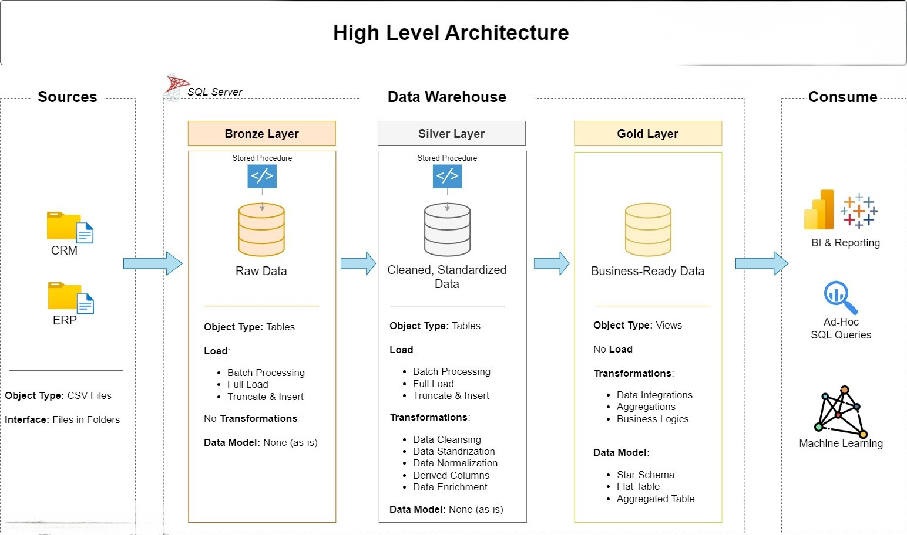

# End-to-End Data Warehouse & Analytics Project

Welcome to my **End-to-End Data Warehouse and Analytics Project** 🚀  
This repository demonstrates a complete data engineering workflow - from raw data ingestion to analytics-ready reporting - following modern, industry-aligned best practices.

This project is built as a **hands-on learning and portfolio project** to showcase practical data warehousing concepts, ETL design, and analytical data modeling.

---

## 🏛️ Architecture Overview

This project follows the **Medallion Architecture**, organized into **Bronze**, **Silver**, and **Gold** layers.



### Architecture Layers

**Bronze Layer (Raw Data)**
- Stores raw data exactly as received from source systems  
- Data is ingested from CSV files into a SQL Server database  
- No transformations are applied at this stage  

**Silver Layer (Cleansed Data)**
- Data is cleaned, standardized, and validated  
- Handles missing values, formatting issues, and inconsistencies  
- Prepares data for analytical use  

**Gold Layer (Analytics Ready)**
- Contains business-ready datasets  
- Data is modeled using a **star schema**  
- Optimized for reporting and analytical queries  

---

## 📌 Project Objective

The primary objective of this project is to **design and implement a modern data warehouse** that consolidates data from multiple source systems and enables meaningful analytical insights.

This project focuses on:
- Building reliable ETL pipelines  
- Applying proper data modeling techniques  
- Creating clean, analytics-friendly datasets  
- Following real-world data engineering practices  

---

## 🔧 What This Project Covers

- **Data Warehouse Design**
  - Medallion Architecture (Bronze, Silver, Gold)
  - Clear separation of raw, processed, and analytical data

- **ETL Development**
  - Extracting data from CSV source systems
  - Transforming and cleansing data using SQL
  - Loading structured data into analytical tables

- **Data Modeling**
  - Designing fact and dimension tables
  - Implementing a star schema for analytics

- **Analytics & Reporting**
  - Writing analytical SQL queries
  - Enabling business insights from curated data

---

## 🧠 Skills Demonstrated

- SQL Development  
- Data Warehousing Concepts  
- ETL Pipeline Design  
- Data Modeling (Star Schema)  
- Data Quality & Validation  
- Analytical Reporting  

---

## 🛠️ Tools & Technologies

All tools used in this project are **free**:

- **Datasets**: CSV files available in the `datasets/` directory  
- **SQL Server Express**: Data warehouse engine  
- **SQL Server Management Studio (SSMS)**: Database management and querying  
- **Git & GitHub**: Version control and collaboration  
- **Draw.io**: Architecture, data flow, and modeling diagrams  

---

## 🎯 Project Requirements

### Data Engineering Scope

**Objective**  
Build a modern data warehouse to consolidate sales-related data and support analytical reporting.

**Key Requirements**
- Data ingestion from **two source systems** (ERP and CRM)
- Source data provided as CSV files
- Data cleansing and quality checks before analysis
- Unified, analytics-friendly data model
- Focus on **current data only** (no historization)
- Clear documentation for data models and transformations

---

## 📁 Repository Structure
```
end-to-end-data-warehouse/
│
├── datasets/ # Raw source data (ERP and CRM CSV files)
│
├── docs/ # Architecture and documentation
│ ├── etl.png # ETL process and techniques
│ ├── data_architecture.png # Medallion architecture diagram
│ ├── data_catalog.md # Dataset descriptions and metadata
│ ├── data_flow.png # Data flow diagram
│ ├── data_models.png # Star schema data models
│ ├── naming-conventions.md # Naming standards
│
├── scripts/ # SQL scripts by layer
│ ├── bronze/ # Raw data ingestion
│ ├── silver/ # Data cleansing and transformation
│ ├── gold/ # Analytical models
│
├── tests/ # Data quality and validation scripts
│
├── README.md # Project overview
├── .gitignore # Git ignored files
```
---

▶️ How to Run This Project (Step-by-Step)

This section explains how to set up and run the project locally using SQL Server Express and SSMS.

✅ Prerequisites

Before starting, make sure you have the following installed:

SQL Server Express

Download and install SQL Server Express (Database Engine)

Use default settings during installation

SQL Server Management Studio (SSMS)

Used to create databases, run SQL scripts, and validate data

Git

To clone this repository

📥 Step 1: Clone the Repository

Clone the project repository to your local machine:

git clone https://github.com/<your-username>/end-to-end-data-warehouse.git
cd end-to-end-data-warehouse

🗄️ Step 2: Create the Database

Open SQL Server Management Studio (SSMS)

Connect to your local SQL Server instance

Create a new database (example name):

CREATE DATABASE SalesDataWarehouse;


Select the newly created database before running any scripts

📂 Step 3: Load Raw Data (Bronze Layer)

Navigate to the datasets/ folder

Review the ERP and CRM CSV files to understand the source data

Go to scripts/bronze/

Run the SQL scripts in this folder to:

Create raw (bronze) tables

Load CSV data into SQL Server tables

📌 Purpose:
The Bronze layer stores raw data as-is, without transformations.

🧹 Step 4: Transform Data (Silver Layer)

Navigate to scripts/silver/

Run the SQL scripts in order to:

Clean invalid or missing values

Standardize column formats

Apply basic business rules

📌 Purpose:
The Silver layer ensures data quality and consistency before analytics.

⭐ Step 5: Build Analytical Models (Gold Layer)

Navigate to scripts/gold/

Run the SQL scripts to:

Create dimension tables

Create fact tables

Implement a star schema

📌 Purpose:
The Gold layer provides analytics-ready data optimized for reporting.

🧪 Step 6: Validate Data Quality

Navigate to the tests/ folder

Run validation scripts to:

Check row counts

Verify key relationships

Detect nulls or data anomalies

📌 Purpose:
Ensures the pipeline produces reliable and trustworthy data.

📊 Step 7: Run Analytical Queries

Once the Gold layer is ready, you can:

Write SQL queries on fact and dimension tables

Generate sales, customer, and product insights

Use the data for reporting or dashboard tools
